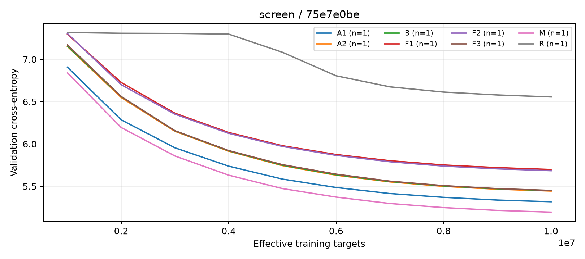
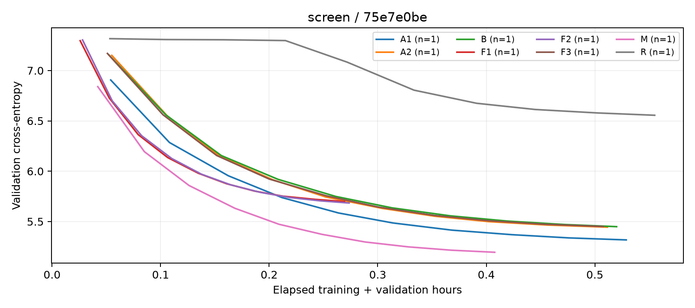

# YuchenModel

一个用 PyTorch 手写、从零训练的轻量语言模型项目。当前工作聚焦于：在约 47M 参数的规模下，组合线性递推、潜空间注意力、MoE 和跨层残差，并通过受控实验判断各模块是否真正带来收益。

## 动机

小模型的参数和单卡算力有限，不能只凭模块的理论优势决定架构。Gated DeltaNet（GDN）提供递推状态流式和缓存，MLA 提供全局信息交互，Stable Latent MoE 增加专家容量，AttnRes 融合一个周期内的层输出；这些设计也可能增加训练成本、推理延迟或不稳定性。本项目先建立可复现的 baseline，再逐项比较验证 CE、参数量和速度。

项目还实现了 Mamba2、NoPE MLA、Embedding Gated MLA、SwiGLU 和 SiTUGLU，作为同一实验框架下的候选模块。训练代码覆盖预训练、LoRA／全参微调和 On Policy Distillation；下文的结果只讨论预训练与架构消融。

## Baseline

**模型 B（默认架构）**：8 层、隐藏维 512、8 个注意力头，以 `3 × GDN + 1 × MLA` 为一个周期，共两个周期；使用 Stable Latent MoE（8 个路由专家、每 token 选 2 个，另有 2 个共享专家，专家中间维 704、潜空间维 128）和 AttnRes。词嵌入与输出头共享权重。GDN 的 chunk 路径用于训练，递推状态和卷积状态用于增量生成；MLA 使用潜空间 KV 和部分 RoPE。默认配置以 8192 词表计算有 47,237,392 个参数，其中 47,237,376 个可训练；训练入口会按实际 tokenizer 大小构建模型。

**当前预训练记录的配置**：本地 `train/pre_train/weight/pretrain_gibc/train_config.json` 记录了长度 512、batch size 10、梯度累积 16、1 个 epoch、学习率 `3e-4`、BF16 autocast、FP32 主权重和关闭 `torch.compile`。每次完整更新最多处理 81,920 个输入 token（含 padding），有效预测 token 数更少。验证集按样本索引固定划出 1%（seed 2026）；验证 CE/PPL 按有效预测目标加权，且不含 MoE 辅助损失。

本地 `train/pre_train/weight/pretrain_gibc/validation.jsonl` 在第 4,863 次更新、epoch 结束时记录验证 CE **3.6365**、PPL **37.96**（3,459,294 个预测目标）。这些训练记录当前未纳入版本控制；这是单次预训练的验证结果，不是下文受控消融的 B 组成绩，也不能与其他配置直接比较。

运行前，在 `train/pre_train/pretrain.py` 的 `TrainConfig` 中检查 `project_dir`、`tokenizer_dir`、`data_file` 和 `save_path`。首次训练须设 `resume=False` 并使用空输出目录；续训时设为 `True` 并指向已有恢复权重。新 tokenizer 要重新训练，修改 `vocab_size` 不会改变已有 tokenizer；旧 12 层权重也不能直接用于当前 8 层模型。

```bash
python test/report_parameter_count.py
python -m train.pre_train.pretrain
```

预训练在 `save_path` 下写入 `train_config.json`、`validation.jsonl`，以及 `pretrain_weight_512_moe_resume.pth` 等恢复权重和 FP16 推理权重；验证 CE 改善时另存 `pretrain_best_*`。恢复训练应保持数据、tokenizer 和模型配置一致。相关入口见 [`train/pre_train/pretrain.py`](train/pre_train/pretrain.py)。

## 实验表

`runs/arch_v1` 已完成 [`experiments/config.py`](experiments/config.py) 定义的全部 8 组单项筛选。以下数值来自各组的 `summary.json`、`metrics.json`，并与 [`筛选汇总`](runs/arch_v1/screen_report/summary.json) 核对；实验阶段为 `screen`，`smoke=false`，全部运行状态为 `complete`，跳过的优化器更新均为 0。**本轮只有一个随机种子，结果属于探索性证据。** 上节完整预训练的 CE 3.6365 使用不同训练预算和验证协议，不混入本轮比较。

### 本轮实验协议

- **数据与随机种子**：共用 `data/arch_v1` 的数据切分和 8192 词表 tokenizer，训练 seed 为 42，数据 seed 为 2026；各组记录的数据、代码和环境指纹一致。
- **训练预算**：每组从初始化开始训练 **10,000,000 个有效预测目标**，不计 padding 和被忽略的标签；序列长度 512，micro batch 8，每次更新的目标预算 `tokens_per_update=16,384`。每累计 1,000,000 个有效目标验证一次，共 10 个验证点。
- **优化与精度**：AdamW，学习率 `3e-4`，warmup 比例 3%，最低学习率比例 0.1，weight decay 0.1，梯度裁剪 1.0；BF16 autocast。
- **验证口径**：每次按固定顺序评估验证集前 **2,000,000 个有效预测目标**，按目标数加权计算语言模型 CE，不含 MoE 辅助损失；PPL 为 `exp(CE)`。下表报告 1000 万训练目标处的最终验证值。
- **记录环境**：NVIDIA GeForce RTX 5060 Laptop GPU，Python 3.11.15，PyTorch `2.12.1+cu132`，CUDA 13.2。完整配置见 [`screen.json`](runs/arch_v1/screen.json)，预检记录见 [`preflight_mb8_eval2m.json`](runs/arch_v1/preflight_mb8_eval2m.json)；8 组均通过预检，包含 100 步小样本拟合检查。

### 验证结果

CE、PPL 越低越好；`ΔCE = 本组 CE − B 组 CE`，负值表示本轮优于基线。参数量为总参数量，包含共享嵌入与输出头。

| 组别 | 相对 B 的配置 | 验证 CE | ΔCE | 验证 PPL | 总参数量 |
| --- | --- | ---: | ---: | ---: | ---: |
| B | GDN + MLA + Stable Latent MoE（专家 SiTUGLU）+ AttnRes | 5.4492 | 0.0000 | 232.58 | 47,237,392 |
| M | GDN → Mamba2 | **5.1948** | **−0.2545** | **180.33** | 50,727,712 |
| A1 | MLA → NoPE MLA | 5.3175 | −0.1317 | 203.88 | 47,646,848 |
| A2 | MLA → Embedding Gated MLA | 5.4442 | −0.0050 | 231.41 | 48,417,168 |
| F1 | MoE → 稠密 SwiGLU | 5.6985 | +0.2492 | 298.41 | 20,232,976 |
| F2 | MoE → 稠密 SiTUGLU | 5.6842 | +0.2350 | 294.19 | 20,227,344 |
| F3 | MoE 专家 SiTUGLU → SwiGLU | 5.4511 | +0.0019 | 233.02 | 47,293,712 |
| R | 关闭 AttnRes | 6.5559 | +1.1066 | 703.37 | 47,237,392 |

**测试 CE/PPL 和推理延迟：8 组均尚未评估。** 当前目录中没有多种子确认、同参数量稠密对照或组合方案的完成记录。

### 训练成本

训练耗时取 `summary.json` 的 `train_seconds`，累计数据取批、前向、反向和优化器更新的时间，不含验证、保存权重和 W&B 日志写入。平均吞吐按 `10,000,000 / train_seconds` 计算，单位为有效预测目标/s；它与 `screen.json` 中训练前的短程校准吞吐是不同统计。运行耗时取 `metrics.json` 的 `wall_seconds`，包含验证及已发生的保存与日志开销，但最后一次保存发生在最后一个计时点之后。峰值显存取 `torch.cuda.max_memory_allocated`，按 GiB（2³⁰ 字节）换算，包含训练和验证期间的分配，不等于显卡总占用。

| 组别 | 训练耗时（分钟） | 运行耗时（分钟） | 平均训练吞吐（有效目标/s） | 峰值分配显存（GiB） |
| --- | ---: | ---: | ---: | ---: |
| B | 20.21 | 31.20 | 8,248 | 4.36 |
| M | 15.87 | 24.47 | 10,503 | 4.49 |
| A1 | 20.72 | 31.74 | 8,045 | 4.37 |
| A2 | 19.89 | 30.69 | 8,381 | 4.43 |
| F1 | 9.74 | 16.17 | 17,103 | 2.84 |
| F2 | 9.95 | 16.42 | 16,747 | 2.93 |
| F3 | 19.92 | 30.46 | 8,366 | 4.01 |
| R | 21.52 | 33.31 | 7,743 | 4.20 |

同有效目标预算、同隐藏维度不等于同参数量或同计算量。这些耗时是本轮运行的实测值，尚未通过重复测速估计波动；不能据此推断推理速度。

### 验证曲线与原始记录





第二张图使用 `wall_seconds`，包含验证等运行开销，与上表的纯训练耗时不同。轻量实验记录与图表位于 `runs/arch_v1`，包括 [`自动报告`](runs/arch_v1/screen_report/report.md)、[`CSV 汇总`](runs/arch_v1/screen_report/summary.csv)、[`训练日志`](runs/arch_v1/screen_run.log) 和 [`逐组运行目录`](runs/arch_v1/models/screen)；后者公开配置、验证轨迹和最终汇总，checkpoint 与训练数据保留在本地。

实验记录中的 `source.git_commit` 和 `source.sha256` 对应跑实验时的本地代码快照，与本次只发布文档及结果的分支不同。重新训练需匹配原始代码、数据和 tokenizer，或重新预检并生成新的冻结计划；原计划会检查代码及数据指纹，不能直接用于不同快照。

后续以验证 CE 选候选，通过多种子和参数对齐对照确认，再冻结候选并评估测试集与推理延迟。`--smoke` 只验证流程，不能作为架构收益的证据。

```bash
python -m experiments.cli --help
```

安装 `requirements-experiments.txt` 中的依赖后，可用公开的轻量记录重新生成报告，无需 checkpoint：

```bash
python -m experiments.cli report --runs runs/arch_v1/models --output runs/arch_v1/screen_report
```

训练和断点恢复的参数见 `run --help`。本轮本地训练入口还支持 W&B 日志扩展，该代码未随本次文档与结果发布；公开分支的示例使用现有 CLI 参数。

## 消融

- **混合器（M）**：保持 MLA 层和其余设置一致，将周期中的 GDN 替换为 Mamba2。本轮验证 CE 比 B 低 0.2545，训练耗时减少约 21.5%，是当前最有希望的单项候选；总参数量也从 47.24M 增至 50.73M，收益还需参数对齐和多种子确认。
- **注意力（A1、A2）**：A1 的 NoPE MLA 比 B 低 0.1317 CE，训练耗时增加约 2.5%；A2 的 Embedding Gated MLA 仅低 0.0050 CE，单种子不足以确认这类小差异。A2 同时涉及位置编码与门控变化，不能把差异单独归因于门控。
- **FFN／MoE（F1、F2、F3）**：F1、F2 将 MoE 换成稠密 FFN，总参数量降至约 20.23M，训练耗时约减半，但 CE 分别比 B 高 0.2492、0.2350；这体现本轮质量与成本的取舍，不能直接证明同参数量下 MoE 更好。F3 只替换 MoE 专家内部的 FFN，CE 比 B 高 0.0019，本轮未显示明确的质量优势。
- **跨层残差（R）**：关闭 AttnRes 后，验证 CE 比 B 高 1.1066。验证轨迹在前 400 万训练目标处下降较慢，之后才明显改善；本轮支持保留 AttnRes，但尚不能据此断言更长训练预算下的最终差距。

组合方案只有在单项筛选后重新训练、独立评估，才能判断实际效果；单项收益不能相加推断组合收益。实验工具提供同总参数量稠密对照、多种子确认和报告生成；详见 `experiments/cli.py` 的 `select`、`match`、`freeze`、`evaluate`、`report` 子命令。

## 结论

默认架构已完成一次完整预训练，验证 CE 为 **3.6365**；另一次独立的 1000 万有效目标、seed 42 筛选已完成全部 8 组对照，其中 B 的 CE 为 **5.4492**，M（Mamba2）的 **5.1948** 最低，A1（NoPE MLA）的 **5.3175** 次之。稠密 FFN 训练成本更低但本轮 CE 更高；关闭 AttnRes 的退化最明显。

下一步优先对 B、M、A1 进行多种子确认和参数对齐比较；若尝试 Mamba2 + NoPE MLA 组合，需要重新训练并独立评估，不能将两个单项收益相加。最终架构仍应依据更长预算下的验证结果，以及冻结后的测试 CE、推理延迟和显存共同决定。
