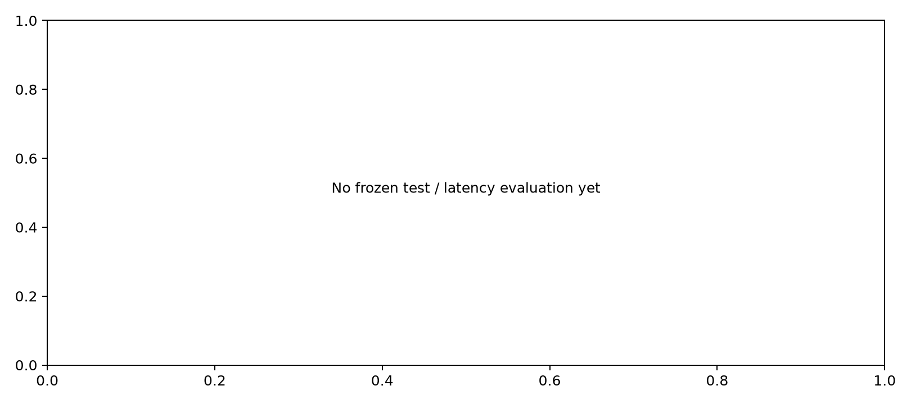

# 模块对比实验报告

测试集仅用于冻结后的最终评估。单种子结果为探索性证据；三种子的方向/标准差检查不等价于显著性检验。

| 阶段 | 模型 | 种子数 | 验证 CE | 测试 CE | 参数量 | 判断 |
|---|---|---:|---:|---:|---:|---|
| screen | A1 | 1 | 5.3175 | 尚未评估 | 47,646,848 | single_seed_exploratory |
| screen | A2 | 1 | 5.4442 | 尚未评估 | 48,417,168 | single_seed_exploratory |
| screen | B | 1 | 5.4492 | 尚未评估 | 47,237,392 | single_seed_exploratory |
| screen | F1 | 1 | 5.6985 | 尚未评估 | 20,232,976 | single_seed_exploratory |
| screen | F2 | 1 | 5.6842 | 尚未评估 | 20,227,344 | single_seed_exploratory |
| screen | F3 | 1 | 5.4511 | 尚未评估 | 47,293,712 | single_seed_exploratory |
| screen | M | 1 | 5.1948 | 尚未评估 | 50,727,712 | single_seed_exploratory |
| screen | R | 1 | 6.5559 | 尚未评估 | 47,237,392 | single_seed_exploratory |

同token和同宽度不等于同参数量或同计算量；激活参数估计不是FLOPs。
GatedMLA比较包含位置编码和门控变化，FFN变体比较包含完整计算形式与bias差异。
未重复的筛选单项不提供组合收益的确定归因。没有对照的交互效应仍需后续消融。

